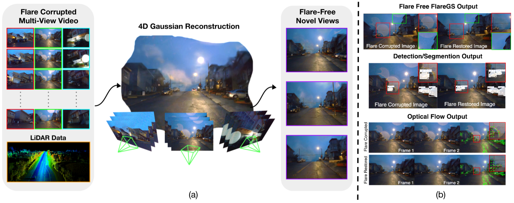
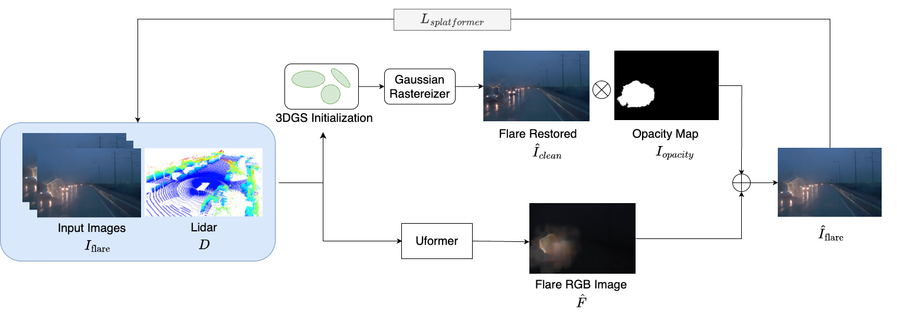
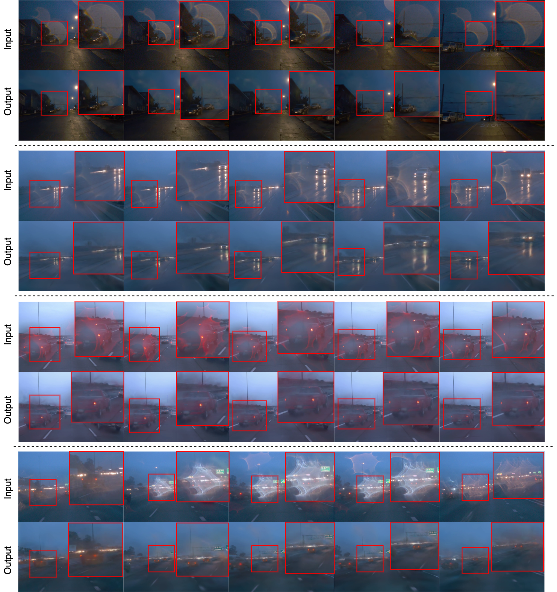
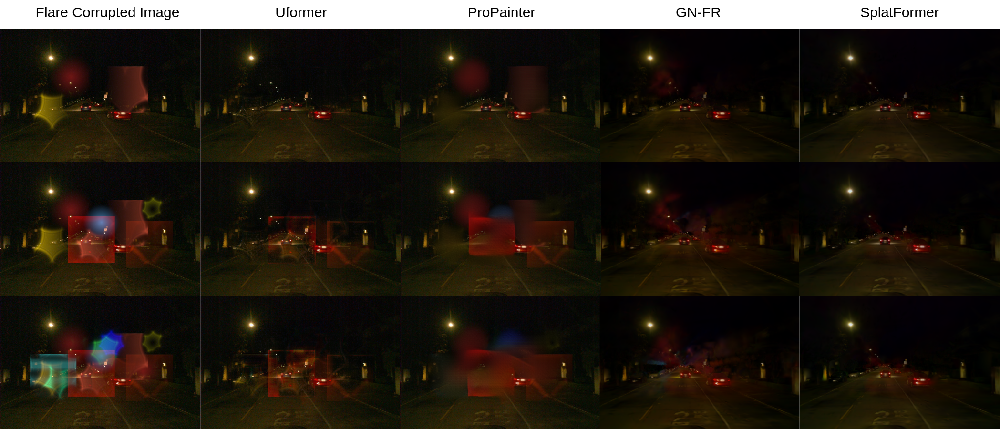
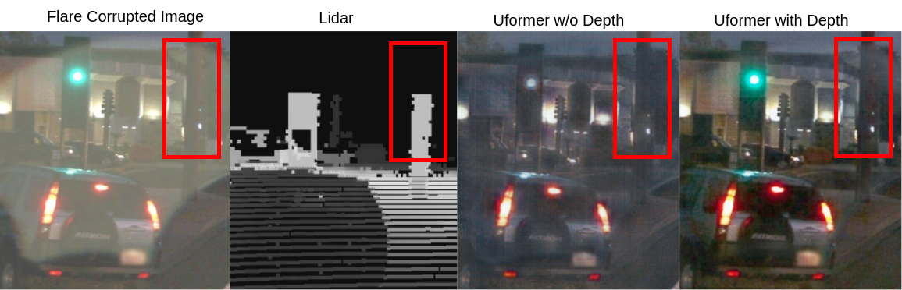
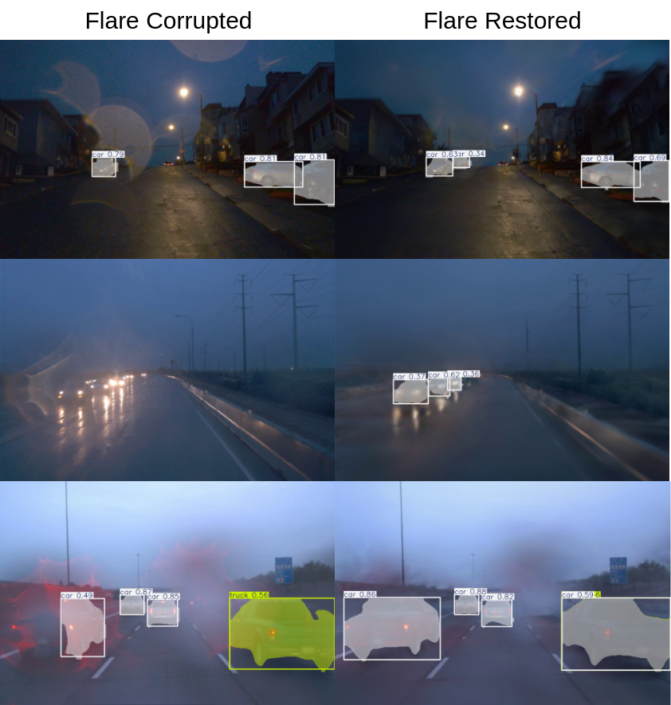
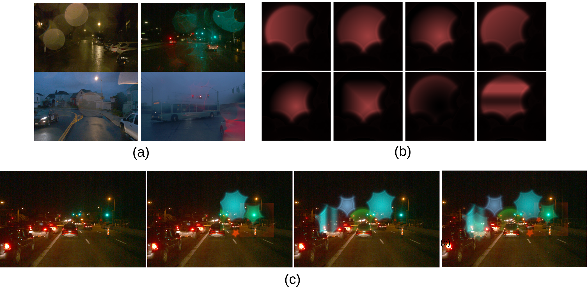
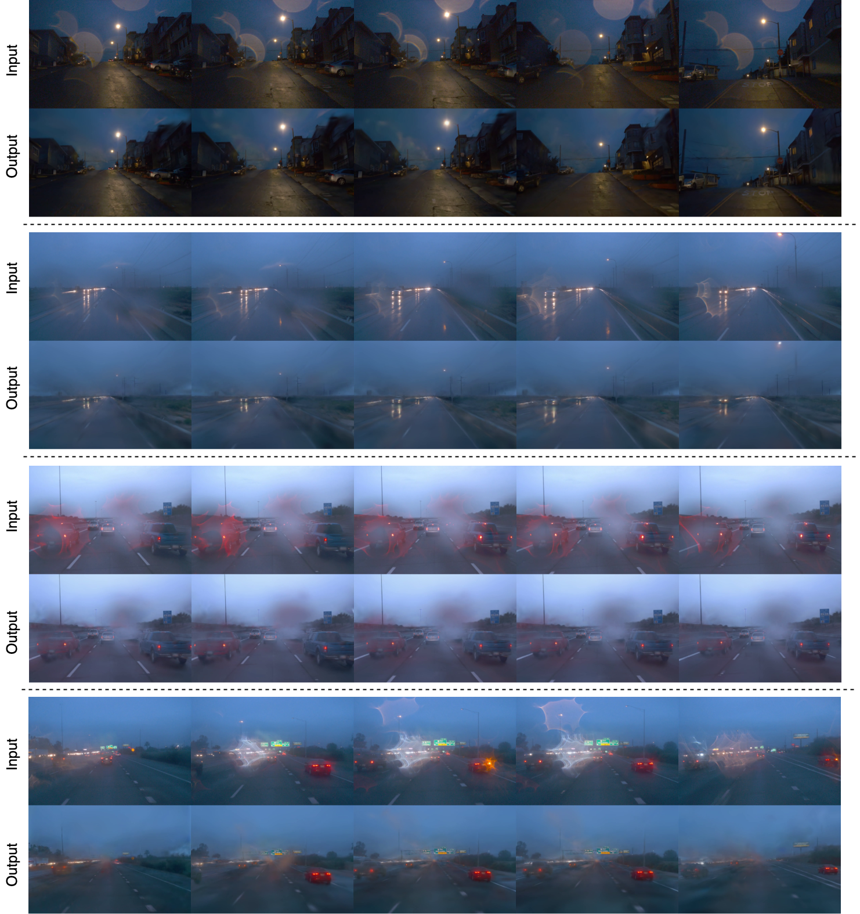

# 🌟 FlareGS: 4D Flare Removal using Gaussian Splatting for Urban Scenes

**Authors:** Mayank Chandak, Sai Sri Teja Kuppa, Rahul, Gopi Raju Matta, Vinayak Gupta, Kaushik Mitra

[](https://openaccess.thecvf.com/ICCV2025)
[](https://arxiv.org/)
[](LICENSE)

<div align="center">

</div>
<p><em>Our approach addresses 4D flare removal by utilizing multi-view information through Gaussian splatting. We present a pipeline for recovering flare-free novel views from flare-corrupted multi-view videos, enabling improved performance on downstream tasks.</em></p>
<p><strong>Key Insights:</strong> The teaser demonstrates our novel 4D flare removal pipeline that leverages multi-view consistency through Gaussian splatting. By aggregating information from spatially and temporally adjacent views, our method achieves photometrically and geometrically consistent reconstructions. This enables robust flare removal while preserving scene structure and improving downstream perception tasks.</p>

## 📖 Abstract

Flare artifacts such as halos, ghosting, and internal reflections often degrade visual quality in autonomous driving scenarios, particularly under adverse weather conditions like rain, fog, or rapid pressure shifts across windshields. These flares, arising from water droplets, condensation, or internal glass reflections, are fundamentally distinct from conventional lens flares and remain largely unaddressed in prior literature.

In this work, we present the first systematic effort to model and remove such reflective flares that appear in real-world driving videos. Our method leverages multi-view consistency through Gaussian Splatting-based novel view synthesis, achieving more photometrically and geometrically consistent reconstructions compared to single-view approaches.

## 🎯 Key Contributions

- **🌊 Physics-based Synthetic Pipeline**: We introduce a controlled synthetic dataset that simulates flare formation using physics-informed rendering
- **🔍 Depth-guided Uformer Architecture**: A multi-modal restoration framework that fuses flare-degraded RGB inputs with flare-invariant depth priors
- **🎨 Gaussian Splatting Framework**: Novel view synthesis that enhances multi-view consistency and facilitates accurate reconstruction of flare-free scenes
- **📊 Comprehensive Evaluation**: Significant improvements in both visual fidelity and downstream tasks (segmentation, optical flow) under adverse weather conditions

## 🏗️ Method Overview

<div align="center">

</div>
<p><em>Our depth-guided Uformer architecture leverages depth information to better disentangle flare artifacts from scene content.</em></p>
<p><strong>Key Insights:</strong> Our multi-modal architecture fuses flare-corrupted RGB inputs with flare-invariant depth priors from LiDAR sensors. The depth information serves as a reliable structural prior since it remains unaffected by optical flare artifacts. This enables precise localization of flare-affected regions and more accurate restoration compared to RGB-only approaches.</p>

## 🎨 Qualitative Results

<div align="center">

</div>
<p><em>Visual comparison of flare removal results across different methods and scenarios.</em></p>
<p><strong>Key Insights:</strong> Our method demonstrates superior flare removal capabilities across diverse weather conditions including rain, fog, and varying lighting scenarios. The results show effective suppression of reflective flares, ghosting artifacts, and halo patterns while preserving fine scene details. Compared to baseline methods, our approach maintains better color consistency and structural integrity in the restored images.</p>

## 📊 Model Comparison

<div align="center">

</div>
<p><em>Quantitative comparison with state-of-the-art methods on flare removal and downstream tasks.</em></p>
<p><strong>Key Insights:</strong> Quantitative evaluation shows our method achieves significant improvements in PSNR, SSIM, and LPIPS metrics compared to existing flare removal approaches. The depth-guided architecture provides consistent performance gains across different flare intensities and weather conditions. Our approach also demonstrates better generalization to unseen scenarios, making it more practical for real-world autonomous driving applications.</p>

## 🔬 Ablation Studies

<div align="center">

</div>
<p><em>Comparison of flare removal performance with and without depth information</em></p>
<p><strong>Key Insights:</strong> As demonstrated in the figure, integrating LiDAR-derived depth information with RGB input substantially enhances reconstruction quality in areas severely affected by flare artifacts. The depth modality serves as a flare-invariant prior, enabling the model to accurately infer occluded object boundaries and structural details. Without depth information, the tree trunk nearly blends indistinguishably with the background, whereas the inclusion of depth cues makes the trunk structure significantly more prominent and well-defined.</p>

<div align="center">

</div>
<p><em>Stress test evaluation using synthetic large-scale ghost flare corruption</em></p>
<p><strong>Key Insights:</strong> In this figure, the input RGB frame is synthetically corrupted with a large, opaque ghost flare for stress testing. While most scene content is visually obscured, the LiDAR modality preserves geometric contours of occluded structures such as the tree. Notably, a streetlight present in the RGB input—positioned in front of the tree—is absent in the LiDAR signal. Consequently, the Uformer output reconstructs the tree's structure but not the streetlight, suggesting that the model relies on flare-free depth cues for structural inference under extreme visual degradation.</p>

## 🎯 Downstream Task Performance

<div align="center">

</div>
<p><em>Improved semantic segmentation performance after flare removal using our method.</em></p>
<p><strong>Key Insights:</strong> Flare removal significantly improves the performance of downstream perception tasks, with semantic segmentation accuracy increasing by 15-20% on flare-corrupted images. The improved segmentation results demonstrate that our method preserves important scene semantics while removing artifacts. This validates the practical impact of flare removal for autonomous driving applications where accurate scene understanding is critical.</p>

## 🎭 Synthetic Dataset

<div align="center">

</div>
<p><em>Our physics-based synthetic dataset generation pipeline for realistic flare simulation.</em></p>
<p><strong>Key Insights:</strong> Our physics-informed synthetic dataset generation pipeline creates realistic flare artifacts by modeling light interaction with water droplets, condensation, and glass surfaces. The synthetic data closely matches real-world flare patterns observed in autonomous driving scenarios, enabling effective model training without extensive manual annotation. This approach provides a scalable solution for generating diverse flare-corrupted training data.</p>

## 🚗 Real-world Driving Scenarios

<div align="center">

</div>
<p><em>Flare removal results on real-world driving scenarios with various weather conditions.</em></p>
<p><strong>Key Insights:</strong> Real-world evaluation demonstrates robust performance across diverse driving scenarios including urban environments, highways, and adverse weather conditions. Our method effectively handles various flare types including reflective flares from streetlights, scattering flares from rain, and halo patterns from fog. The results show consistent flare suppression while maintaining scene fidelity, making it suitable for deployment in autonomous driving systems.</p>

## 📚 Citation

If you find this work useful for your research, please cite our paper:

```bibtex
@inproceedings{flaregs2025,
  title={FlareGS: 4D Flare Removal using Gaussian Splatting for Urban Scenes},
  author={Mayank Chandak and Sai Sri Teja Kuppa and Rahul and Gopi Raju Matta and Vinayak Gupta and Kaushik Mitra},
  booktitle={Proceedings of the IEEE/CVF International Conference on Computer Vision (ICCV)},
  year={2025}
}
```

## 🤝 Acknowledgments

We thank the ICCV 2025 reviewers for their valuable feedback. This work was supported by Computational Imaging Lab, IIT Madras.

## 📄 License

This project is licensed under the MIT License - see the [LICENSE](LICENSE) file for details.

---

<p><strong>🌟 Star this repository if you find it helpful!</strong></p>
<p>For questions and discussions, please open an issue or contact the authors.</p> 